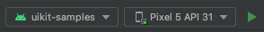

# UIKit Sample - AI Chatbot
This sample demonstates the chat experience with the AI Chatbot that is running on the sendbird platform by using UIKit.
To see more details about the ai chat bot, please refer this [documentation](https://sendbird.com/docs/ai-chatbot/guide/v1/overview).

AI Chatbot is disabled by default, because it has some prerequisites to run properly.
1. You can skip this step if you use default application id that is provided by default.   
  You need to create your bot in your application, by following this [guide]((https://sendbird.com/docs/ai-chatbot/guide/v1/sendbird-dashboard/sendbird-dashboard-overview).
2. Set the value as `true` of this line in [BaseApplication.kt](../BaseApplication.kt)
```kotlin
internal const val enableAiChatBotSample = true
```


## Prerequisites
- Android Studio Giraffe
- JDK 11
- AI Chatbot

## How to run
The following series of steps illustrate how to run the sample app.
1. Clone the repository
```
git@github.com:sendbird/sendbird-uikit-android.git
```
2. Open a directory in Android Studio.
3. Change the run configuration to "uikit-samples"  .

4. Run the sample app.
5. Click the "Talk to an AI Chatbot" button.

## How it works
You can start chat with your bot using the function `SendbirdUIKit.startChatWithAiBot`.
Application id and bot id is provided by default in this sample.
To create your own bot in your application, please follow this [guide]((https://sendbird.com/docs/ai-chatbot/guide/v1/sendbird-dashboard/sendbird-dashboard-overview)).
```kotlin
SendbirdUIKit.startChatWithAiBot(this, botId, true) { error ->
    if (error != null) {
        ContextUtils.toastError(this, "Failed to start chat with ai bot. ${error.message}")
    }
}
```